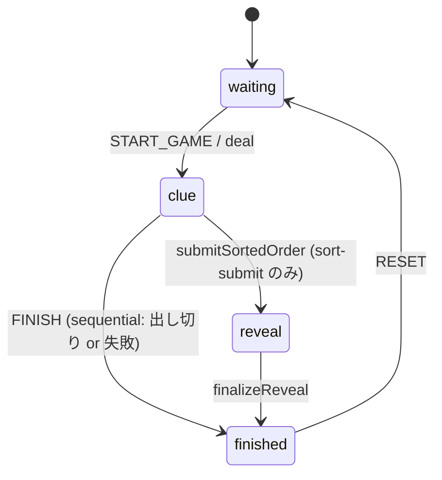

# ゲームロジック概要 (Game Logic Overview)

このドキュメントは本リポジトリの ITO 風カードゲームのコアロジック（状態遷移 / データ構造 / アクション / 判定アルゴリズム）を、開発者が短時間で把握・拡張できるように要約したものです。

---

## 1. 目的 (Purpose)

- クイックにゲームフロー全体像を把握
- 状態 / データ構造 / UI アクションの責務分離を明確化
- 仕様変更・不具合調査時の参照起点を一本化
- 改修余地（リファクタ / テスト / 拡張ポイント）を早期に提示

---

## 2. 全体アーキテクチャ (High-level Architecture)

```
[Firestore Rooms Collection]
   └─ room document (status, options, topic, order, deal, result, ...)
         └─ players subcollection (player docs: name, number, lastSeen, ...)

[Client]
  React (Next.js App Router) + Chakra UI v3 (Headless + Panda) + dnd-kit
  ├─ Pure Model: buildHostActionModel（UI から独立した意思決定）
  ├─ Hooks: useHostActions / useDropHandler / useRevealAnimation / ...
  └─ Components: HostControlDock / CentralCardBoard / Panels / etc.

[Game Modes]
  1. sequential（順出し: ドロップしたら即反映）
  2. sort-submit（並べ提出: 並べ終えてから一括提出）
```

---

## 3. 用語 (Glossary)

| 用語                  | 説明                                                                 |
| --------------------- | -------------------------------------------------------------------- |
| status                | ルームの状態: `waiting` → `clue` → (`reveal`) → `finished`          |
| resolveMode           | 遊び方: `sequential` or `sort-submit`                                |
| clue phase            | プレイヤーがヒント→カード提出の段階（UI 上は playing と呼ぶ場合あり） |
| order.list            | 確定済みの並び（sequential の場の順 / sort-submit の最終版）         |
| order.proposal        | sort-submit 用の一時的な並べ替え案                                   |
| deal                  | 配り（seed/min/max/players を元に number を決定するシード情報）      |
| number                | プレイヤーに割り当てられた数字（通常 1..100 の整数）                |
| evaluate（評価）      | sort-submit で最終並びを検査する操作                                  |
| effectiveActive       | 実質アクティブ人数（presence > players.length をフォールバック）     |
| placedCount           | すでに場に出たカード数（proposal があればその長さ、なければ list）   |

---

## 4. 状態機械 (State Machine)

Mermaid による状態遷移図:



テキスト表:

| イベント            | 旧状態   | 新状態   | 概要                               |
| ------------------- | -------- | -------- | ---------------------------------- |
| START_GAME          | waiting  | clue     | 新ラウンド開始（deal 実行）       |
| FINISH              | clue     | finished | すべて確定 or 失敗で終了          |
| submitSortedOrder   | clue     | reveal   | 並べ提出で並びを公開              |
| finalizeReveal      | reveal   | finished | 公開アニメーション完了で確定      |
| RESET               | 任意     | waiting  | ルーム初期化                       |

---

## 5. Room ドキュメント形 (Room Document Shape 概要)

TypeScript の擬似型（詳細は実装に合わせて参照）:

```ts
interface RoomDocLike {
  status: 'waiting' | 'clue' | 'reveal' | 'finished'
  resolveMode: 'sequential' | 'sort-submit'
  topic?: string
  options?: {
    allowContinueAfterFail?: boolean
    timer?: { clueSec?: number; submitSec?: number }
  }
  order: {
    list: string[] // playerId の並び or 提出された順
    proposal?: string[] // sort-submit 用の一時並び
  }
  deal?: {
    seed: string
    min: number
    max: number
    players: { id: string; name: string; number: number }[]
  }
  result?: { success: boolean; mistakes?: number; revealedAt?: number }
}
```

---

## 6. 主要アクションとロジック

- `buildHostActionModel`:
  - UI からの意図（開始/提出/評価/リセット等）を受け、今押せるボタンと無効理由を算出。
  - presence を考慮して `effectiveActive` を計算し、`placedCount` と突き合わせて進行を制御。
- `useHostActions`:
  - Firestore 書き込み（status 遷移 / order 更新 / result 設定）をラップ。
  - `quickStart` 呼び出しは Cloud Functions（Callable）経由に一本化済み。ホストの開始操作は `httpsCallable("quickStart")` を叩き、サーバー側でトピック決定・配札・`roomProposals` 初期化まで行う。カスタムお題も同じ関数を使用。
- `useDropHandler`:
  - DnD のドロップイベントを受け、sequential では `order.list` を即時更新、sort-submit では `proposal` を更新。

---

## 7. 並べ提出（sort-submit）の評価

- `evaluate` は proposal を `order.list` に確定し、`result.success` を設定。
- 成功条件: `order.list` に対応する数字列が昇順（厳密な `<`）であること。
- 失敗時の挙動: `allowContinueAfterFail` が true なら UI 上は継続可能表示、false なら即 `finished`。

---

## 8. 順出し（sequential）の終了条件

- `shouldFinishAfterPlay`: すべてのカードが出揃ったら自動で `FINISH` 可。
- 途中で昇順が破綻したと判定された場合は `FINISH`（失敗）。

---

## 9. DnD（ドラッグ＆ドロップ）

- ライブラリ: dnd-kit（`DndContext` / `SortableContext` / `arrayMove`）
- sort-submit: proposal 上での並べ替えを `SortableItem` で表示・編集。
- sequential: 盤面のスロットへ 1 人ずつカードをドロップ（置いた順が確定順）。

---

## 10. 有効化条件（Enablement）

| ボタン/操作            | 有効条件                                 | 無効理由例                    |
| ---------------------- | ---------------------------------------- | ----------------------------- |
| 開始（quickStart）     | `effectiveActive >= 2`                    | `2人必要: 残り1人`            |
| 評価（evaluate）       | `placedCount == effectiveActive && >= 2` | `まだ置かれていないカード有`   |
| 退室・リセット         | 状態に応じて個別                         | -                             |

---

## 11. エッジケース

| ケース                              | ハンドリング概要                                      |
| ----------------------------------- | ----------------------------------------------------- |
| 二重ドロップ                         | `includes` チェックで無視                             |
| presence 取得失敗                    | フォールバック: `players.length` を使用               |
| proposal 無 / list 併用              | `placedCount` を安全に算出                            |
| アニメーション中の操作               | `reveal` / `finished` ではボタン無効・イベント無視    |
| RESET のすり抜け                     | `nextStatusForEvent` で厳格な検証                     |
| 少人数・partial な並び               | evaluate を無効化し、理由テキストを提示               |

---

## 12. 改善ポイント（Backlog）

- 状態管理: 状態遷移図ベース（XState 等）での一元管理
- テスト: hostActionsModel / evaluate / sequential のユニットテスト充実
- アクセシビリティ: DnD のキーボード操作対応（modifiers）
- パフォーマンス: Firestore の選択読み & メモ化
- デバッグ: `window.__ROOM_SNAPSHOT` などの軽量インスペクタ
- UX: 失敗後の継続許可 UI の明確化
- セキュリティ: 書き込み権限のセキュア化（ルール強化）

---

## 13. FAQ（要点）

- Q: `playing` status は？
  - A: UI 用の別名。実際の状態は `clue`。
- Q: evaluate が押せない / 反応しない
  - A: `topic` 未設定または `placedCount != effectiveActive`。盤面カウンタを確認。
- Q: 並べ替え時の競合は？
  - A: sort-submit では proposal 上での競合のみ。確定はホスト操作で単一化。

---

## 14. 安全な変更手順（How to Change Safely）

1. 状態を追加する場合: `nextStatusForEvent` / hostActionsModel / UI フェーズの 3 点を同時更新
2. 新ボタン追加: hostActionsModel に intent を追加 → useHostActions のハンドラを用意
3. 判定ロジック変更: sequential は `applyPlay/shouldFinishAfterPlay`、sort-submit は `evaluateSorted`
4. 人数・presence の見直し: `effectiveActive` 算出ユーティリティを共通化し一貫使用

—
（本ファイルは UTF-8（BOM なし）で保存されています）
